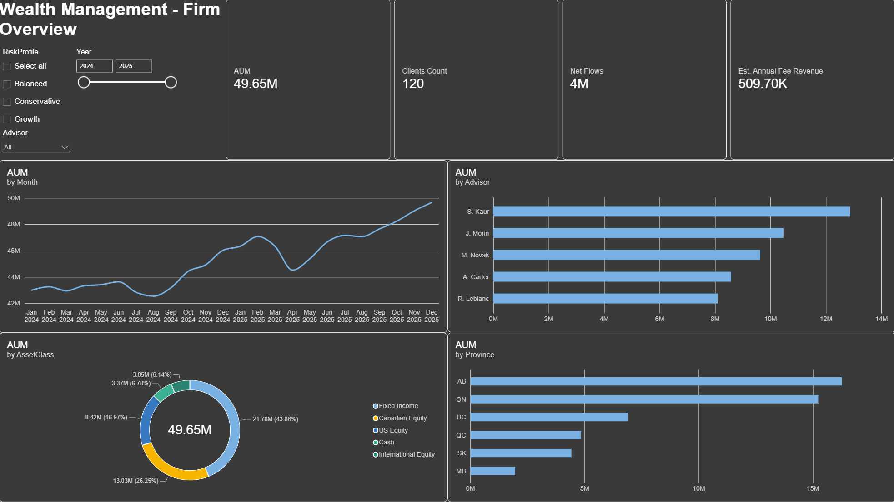
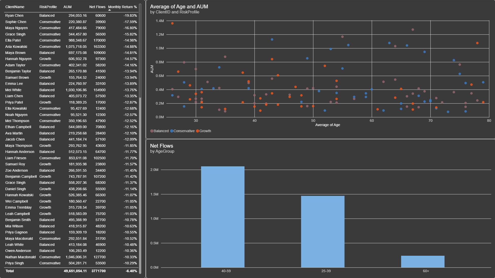

# Wealth Management Portfolio Dashboard (Power BI)

A Power BI dashboard for a fictional Canadian wealth management firm. It tracks $49M+ in assets under management across 120 client portfolios and 5 advisors, using month-end data from January 2024 to December 2025.

I built this to get comfortable with financial data modelling. The charts are the easy part. What I actually wanted to work out was how to measure AUM correctly, and how to tell whether a good month came from the markets or from clients putting in more money.

**A note on the data:** everything here is synthetic. I generated the clients, advisors, holdings and returns for this project. No real client or market data is used.

## Screenshots

### Firm Overview


### Client Analysis


## Data model

Star schema, three dimensions and two fact tables:

| Table | Type | Contents |
|---|---|---|
| `Clients` | Dimension | 120 clients: age, province, risk profile, advisor, advisory fee rate |
| `Assets` | Dimension | 10 holdings: ticker, name, asset class, sector |
| `Date` | Dimension | Calendar table built in DAX, marked as a date table, `Month` sorted by `YearMonth` |
| `Holdings` | Fact | Month-end market value per client per asset, in CAD |
| `Flows` | Fact | Client contributions and withdrawals, in CAD |

Each dimension connects to the fact tables one to many, with single cross filter direction.

## Key measures (DAX)

```dax
AUM = CALCULATE(SUM(Holdings[MarketValue]), 'Date'[Date] = MAX(Holdings[Date]))

AUM Prev Month = CALCULATE([AUM], DATEADD('Date'[Date], -1, MONTH))

Net Flows = SUM(Flows[Amount])

Market Gain = [AUM] - [AUM Prev Month] - [Net Flows]

Monthly Return % = DIVIDE([Market Gain], [AUM Prev Month])

Est. Annual Fee Revenue =
SUMX(VALUES(Clients[ClientID]),
     CALCULATE([AUM]) * CALCULATE(MAX(Clients[AnnualFeeRate])))
```

### Why AUM is not a SUM

Assets under management is a balance at a point in time, not a flow. Summing monthly market values across two years counts the same dollars 24 times and produces a number that means nothing. The measure returns the value at the last date in the current filter context instead, so it aggregates properly whether you look at a month, a quarter or a year.

### Telling market performance apart from client behaviour

AUM can grow for two very different reasons: investments went up, or clients added money. `Market Gain` strips out the flows so only performance is left. That is what lets the dashboard answer whether a strong quarter was actually a strong quarter.

## What the data shows

Markets pulled AUM down in spring 2025. It drops from about $46M to $44M between March and April while net flows stay positive, so clients were still adding money. The decline is performance, not withdrawals.

New money comes mostly from clients aged 40 to 59. The 60+ group adds roughly a tenth of what that group does, which fits the shift from building wealth to drawing on it. For the firm that is a retention and wealth transfer question rather than a performance one.

AUM per advisor ranges from about $8M to $13M, which raises questions about capacity and how books are allocated.

## Files

| File | Description |
|---|---|
| `Wealth_Management_Dashboard.pbix` | Power BI report, opens in Power BI Desktop |
| `Wealth_Management_Dataset.xlsx` | Source data: Clients, Assets, Holdings, Flows |
| `firm-overview.png`, `client-analysis.png` | Dashboard screenshots |

## Tools

Power BI Desktop, DAX, Power Query, Excel
